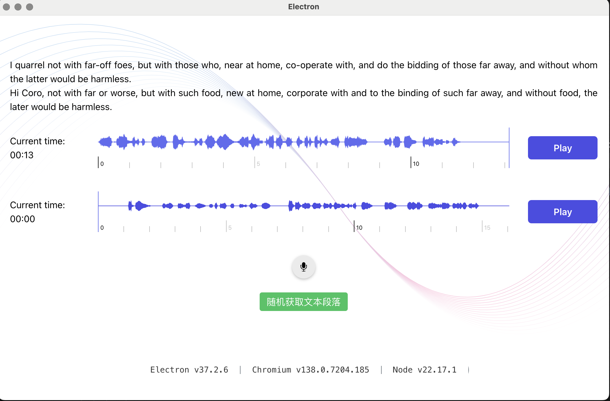

# librivoxreading
a tool  help people  practice speaking  a language with  audio book from librivox.org

## quickstart

download the dmg, install on your MacOS then use it.

[download  macOS Apple Silicon ](https://github.com/stevenyesz/librivoxreading/releases/download/v1.0.0/shadowreading-1.0.0-arm64.dmg)
[download  macOS Apple Intel  ](https://github.com/stevenyesz/librivoxreading/releases/download/v1.0.0/shadowreading-1.0.0-x64.dmg)
